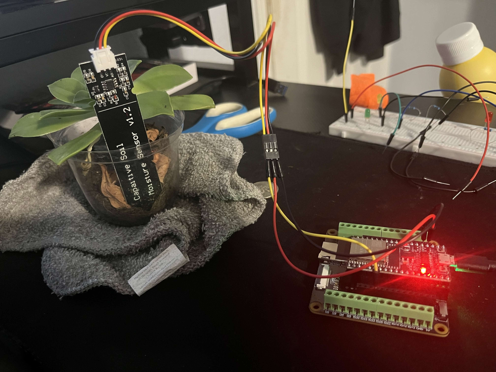

# plant_social
# Plant Social — User Guide

Welcome to **Plant Social**, your AI-powered plant care companion! This guide will help you get the most out of the app's three intelligent features — including real-time soil moisture monitoring with an ESP32 sensor.


*Our capacitive soil moisture sensor v1.2 connected to an ESP32 microcontroller, monitoring a live plant in real time.*

---

## Table of Contents

1. [Overview](#overview)
2. [Getting Started](#getting-started)
3. [Feature 1: Get Plant Tips (CLIP AI)](#feature-1-get-plant-tips)
4. [Feature 2: Plant Doctor (Gemini AI)](#feature-2-plant-doctor)
5. [Feature 3: Smart Soil Sensor (ESP32 + Gemini)](#feature-3-smart-soil-sensor)
6. [Camera Tips](#camera-tips)
7. [Understanding Results](#understanding-results)
8. [Troubleshooting](#troubleshooting)
9. [FAQ](#faq)

---

## Overview

Plant Social combines **AI vision**, **generative AI**, and **IoT hardware** to give your plants the best care possible:

### 🌱 **Get Plant Tips**
Uses image recognition (CLIP AI) to match your plant photo with a curated database of 50+ plant care guides. Perfect for discovering general care tips and best practices.

### 🩺 **Plant Doctor**
Powered by Google's Gemini AI, this feature provides personalized plant health diagnosis. It identifies your plant, spots potential issues, and gives customized care advice based on your specific environment.

### 📡 **Smart Soil Sensor**
An ESP32 microcontroller with a capacitive soil moisture sensor monitors your plant's soil in real time. Readings are sent to the backend API, where Gemini AI interprets the raw voltage data and tells you whether your plant needs water — tailored to the specific plant type.

---

## Getting Started

### First Launch

1. **Allow Camera Access**: When you first open the app, grant camera permissions when prompted. This is essential for scanning your plants.

2. **Home Screen**: You'll see two main action cards:
   - **Green card** → "Get Plant Tips" (CLIP-powered search)
   - **Purple card** → "Plant Doctor" (Gemini AI diagnosis)

3. **Choose Your Feature**: Tap either card to begin!

---

## Feature 1: Get Plant Tips

**Best for**: Learning general plant care, identifying common issues, getting quick tips

### How to Use

1. **Tap the green "Get Plant Tips" card** on the home screen

2. **Take a Photo**:
   - Point your camera at your plant
   - Center the plant in the frame guide
   - Tap the white capture button
   - Review and tap "Use Photo"

3. **View Results**:
   - The app analyzes your image using CLIP AI
   - You'll see **3 matching care guides** ranked by relevance
   - Each result shows:
     - **Match percentage** (higher = more relevant)
     - **Category** (watering, light, soil, pests, etc.)
     - **Title** (e.g., "Overwatering Signs")
     - **Full care tip** text

4. **Clear Results**: Tap "Clear" to start over with a new plant

### What It Searches

The database includes 20+ expert-curated guides covering:
- 💧 **Watering** — overwatering, underwatering, proper technique
- ☀️ **Light** — low light, bright indirect, full sun, sunburn
- 🌱 **Soil** — repotting, soil types
- 🐛 **Pests** — spider mites, fungus gnats, mealybugs
- 🌿 **Plant Types** — succulents, tropical, herbs, flowering
- 🍂 **Health** — brown tips, leggy growth, wilting
- 🌾 **Nutrition** — fertilizing basics

### Example Use Cases

- "My plant has yellow leaves" → Shows overwatering guide
- Photo of a succulent → Shows succulent care & drought-tolerant tips
- Wilting plant → Shows underwatering & watering schedule tips

---

## Feature 2: Plant Doctor

**Best for**: Personalized diagnosis, location-specific advice, identifying specific plant problems

### How to Use

1. **Tap the purple "Plant Doctor" card** on the home screen

2. **Add Environment Context (Optional but Recommended)**:
   - You'll see a text input labeled "Your Plant's Environment"
   - Add details like:
     - **Location**: "Phoenix, AZ" or "Seattle, WA"
     - **Climate**: "Hot and dry" or "Cool and humid"
     - **Placement**: "Indoor, south-facing window" or "Outdoor patio"
     - **Care History**: "Watered twice a week" or "Just repotted"
     - **Season**: "Currently winter" or "In peak summer heat"
   - The AI uses this to give climate-aware, location-specific tips!

3. **Example Context**:
   ```
   I live in Denver, CO. This is an indoor plant near an east-facing 
   window. I water it every 5 days. It's winter here and the air is dry 
   from the heater.
   ```

4. **Take a Photo**:
   - Tap "Scan Your Plant"
   - Take a clear photo of your plant
   - Confirm with "Use Photo"

5. **View Diagnosis**:
   Gemini AI analyzes your photo and returns:
   
   - **Plant Name** — Identified species or common name
   - **Health Status Badge**:
     - ✅ Healthy (green)
     - ⚠️ Needs Attention (yellow)
     - 🚨 Unhealthy (red)
   - **Summary** — Friendly overview of your plant's condition
   - **Issues Detected** — Specific problems (if any)
   - **Care Tips** — 3-5 personalized, actionable recommendations

6. **Scan Another Plant**: Tap "Scan Another Plant" to diagnose more plants

### Why Add Context?

Context makes the AI **much more accurate**. For example:

❌ **Without context**: "Water when soil is dry"  
✅ **With context**: "In Phoenix's dry heat, water every 3-4 days instead of weekly. Consider a humidity tray since indoor air is very dry."

❌ **Without context**: "Needs bright indirect light"  
✅ **With context**: "Your south-facing Seattle window provides excellent light in summer, but supplement with a grow light during dark winter months."

---

## Feature 3: Smart Soil Sensor

**Best for**: Continuous soil monitoring, data-driven watering decisions, knowing exactly when to water

### Hardware Setup

| Component | Details |
|-----------|---------|
| **Microcontroller** | ESP32 (any dev board variant) |
| **Sensor** | Capacitive Soil Moisture Sensor v1.2 |
| **Connection** | Sensor → GPIO 35 (analog), 3.3V power, GND |
| **Communication** | WiFi HTTP POST to the backend API |
| **Reading interval** | Every 30 seconds |

### How It Works

```
┌──────────────────┐       WiFi POST /sensors/moisture      ┌──────────────────┐
│   ESP32 +        │  ──────────────────────────────────►   │                  │
│   Soil Moisture   │   { sensor_id, moisture_value }       │  FastAPI Server  │
│   Sensor v1.2    │                                        │                  │
│                  │  ◄──────────────────────────────────   │                  │
└──────────────────┘   { status, command }                  └────────┬─────────┘
                                                                     │
                                                            ┌────────▼─────────┐
                                                            │   Gemini AI      │
                                                            │   (sensor-ai)    │
                                                            │                  │
                                                            │ Interprets raw   │
                                                            │ voltage + plant  │
                                                            │ type → advice    │
                                                            └──────────────────┘
```

1. The **capacitive soil moisture sensor** reads the soil's dielectric permittivity (how much water is in the soil) and outputs an analog voltage
2. The **ESP32** reads this voltage on GPIO 35 (range 0–4095) and POSTs it to the backend every 30 seconds
3. The **backend** stores the reading and provides a simple status (`thirsty` / `healthy` / `overwatered`)
4. The **Gemini AI endpoint** (`POST /sensor-ai/analyze`) can interpret raw voltage data for a specific plant type, giving smarter, plant-tailored advice

### Sensor Value Guide

| Raw Voltage (0–4095) | Meaning | Status |
|----------------------|---------|--------|
| ~1000–1800 | Wet soil | `overwatered` (if persistent) |
| ~1800–2500 | Moist soil | `healthy` |
| ~2500–4095 | Dry soil | `thirsty` — time to water! |

> **Note**: Capacitive sensors read *inversely* — higher voltage = drier soil. This is the opposite of resistive sensors.

### ESP32 Arduino Code

The sensor firmware lives in `esp32/water-sensor.ino`. Before flashing:

1. **Install the Arduino IDE** and add the ESP32 board package
2. **Edit the WiFi credentials** in the sketch:
   ```cpp
   const char* ssid = "YOUR_WIFI_SSID";
   const char* password = "YOUR_WIFI_PASSWORD";
   const char* serverName = "http://<YOUR_LAN_IP>:8080/sensors/moisture";
   ```
3. **Wire the sensor**:
   - **Red wire** → 3.3V on ESP32
   - **Black wire** → GND on ESP32
   - **Yellow wire** → GPIO 35 on ESP32
4. **Flash** the sketch to the ESP32 via USB
5. **Open Serial Monitor** (115200 baud) to verify it's connecting and sending data

### API Endpoints

#### `POST /sensors/moisture` — Raw sensor data ingestion

Receives raw readings from the ESP32 hardware.

```json
// Request body
{
  "sensor_id": "esp32_jon_1",
  "moisture_value": 2847,
  "battery_level": 3.7       // optional
}

// Response
{
  "status": "success",
  "server_time": "2026-02-15T10:30:00",
  "plant_status": "thirsty",
  "command": "WATER_ON"
}
```

#### `GET /sensors/status` — Get all sensor readings

Returns the latest reading from every connected sensor.

```json
[
  {
    "id": "esp32_jon_1",
    "moisture": 2847,
    "status": "thirsty",
    "needs_water": true,
    "updated_at": "2026-02-15T10:30:00"
  }
]
```

#### `POST /sensor-ai/analyze` — Gemini-powered sensor analysis

Sends raw voltage + plant type to Gemini for intelligent interpretation.

```json
// Request body
{
  "plant_type": "Peace Lily",
  "voltage": 2847
}

// Response
{
  "needs_water": true,
  "status": "thirsty",
  "message": "Peace Lilies prefer consistently moist soil. A voltage of 2847 indicates the soil is getting quite dry — water thoroughly until it drains from the bottom."
}
```

### Debugging the Sensor

**Check if the ESP32 is sending data:**
```bash
# Watch the API logs for incoming sensor data
docker compose logs api -f 2>&1 | grep "Received data"
```

**Test the sensor endpoint manually:**
```bash
curl -X POST http://localhost:8080/sensors/moisture \
  -H "Content-Type: application/json" \
  -d '{"sensor_id": "test_sensor", "moisture_value": 2500}'
```

**Test the AI analysis endpoint:**
```bash
curl -X POST http://localhost:8080/sensor-ai/analyze \
  -H "Content-Type: application/json" \
  -d '{"plant_type": "Monstera", "voltage": 3200}' \
  | python3 -m json.tool
```

**ESP32 not connecting?**
- Check WiFi credentials in the sketch (`ssid` and `password`)
- Make sure the ESP32 and your server are on the same network
- Verify the `serverName` URL points to your machine's LAN IP (not `localhost`)
- Open the Arduino Serial Monitor at 115200 baud for debug output

**Sensor reading stuck at 0 or 4095?**
- Check wiring — sensor may be disconnected
- Make sure you're reading from the correct GPIO pin (35)
- Try a different analog pin if GPIO 35 isn't working on your board

---

## Camera Tips

### Getting the Best Results

✅ **DO:**
- Take photos in good lighting (natural light is best)
- Get close enough to see details
- Include the whole plant if showing overall health
- Focus on problem areas (yellow leaves, spots, etc.)
- Hold steady for clear photos

❌ **DON'T:**
- Take photos in dim lighting or harsh shadows
- Include too much background clutter
- Use blurry or out-of-focus shots
- Photograph from too far away

### Camera Controls

- **Capture Button** (white circle): Take photo
- **Flip Camera** (⟳): Switch between front/rear cameras
- **Close** (✕): Exit camera without taking a photo
- **Retake** (↺): Discard photo and try again
- **Use Photo** (✓): Confirm and analyze

---

## Understanding Results

### Get Plant Tips Results

**Match Score**: 
- **75-100%**: Highly relevant match
- **50-75%**: Good match, likely helpful
- **25-50%**: Moderate match, may be generally useful
- **Below 25%**: Low match, might not be specific to your situation

**Categories** help you quickly identify the topic (watering, light, pests, etc.)

### Plant Doctor Diagnosis

**Health Status**:
- **✅ Healthy**: Plant looks good! Follow the preventative care tips
- **⚠️ Needs Attention**: Minor issues detected, address them soon
- **🚨 Unhealthy**: Significant problems, take action immediately

**Issues vs Tips**:
- **Issues** = problems the AI spotted in your photo
- **Tips** = actionable steps to fix issues or maintain health

---

## Troubleshooting

### Camera Won't Open
- **Solution**: Check that you granted camera permissions in your device settings
- **iOS**: Settings → Privacy & Security → Camera → Plant Social → Enable
- **Android**: Settings → Apps → Plant Social → Permissions → Camera → Allow

### "Failed to get plant tips" Error
- **Check**: Is your internet connection working?
- **Try**: Close and reopen the app
- **Note**: The backend API must be running (for developers)

### "Failed to diagnose plant" Error
- **Gemini API Key**: Make sure your API key is valid and has credits
- **Image Size**: Very large images might timeout — try a smaller photo
- **Try Again**: Network hiccups happen, retry in a moment

### Results Don't Match My Plant
- **Get Plant Tips**: Try retaking with better lighting or a different angle
- **Plant Doctor**: Add more context about your plant's environment
- **Remember**: AI is very good but not perfect! Use results as guidance

### Blank Screen After Photo
- **Solution**: Force close and reopen the app
- **Prevention**: Keep your app updated

---

## FAQ

### Q: Do I need internet to use this?
**A:** Yes, both features require an internet connection to communicate with the AI services.

### Q: Is my plant data stored anywhere?
**A:** Photos are sent to the AI services for analysis but are not permanently stored. Your privacy is respected.

### Q: Which feature should I use?
**A:** 
- Use **Get Plant Tips** for quick, general care guides
- Use **Plant Doctor** for personalized diagnosis and location-specific advice
- Use **both** for comprehensive plant care!

### Q: Can I use this for any type of plant?
**A:** Yes! Both features work with houseplants, outdoor plants, succulents, herbs, vegetables, and more.

### Q: What if the AI misidentifies my plant?
**A:** The care tips are often still useful even if the exact species is wrong. For critical decisions (like whether a plant is toxic), verify with other sources.

### Q: How accurate is the Plant Doctor?
**A:** Gemini AI is highly trained and very accurate, especially when you provide environment context. However, always use AI advice as a helpful guide, not a replacement for professional horticulturist advice for serious issues.

### Q: Can I save my results?
**A:** Currently, results are shown on-screen. Take screenshots to save information for later!

### Q: The app says "Gemini is analyzing" for a long time
**A:** Gemini AI can take 5-15 seconds to process images. If it takes longer than 30 seconds, check your internet connection and try again.

### Q: Why are there two different features?
**A:** They use different AI technologies:
- **Get Plant Tips** matches against a curated database (fast, focused)
- **Plant Doctor** uses generative AI (more flexible, personalized)
- **Smart Sensor** uses hardware + AI for continuous soil monitoring

### Q: Do I need the ESP32 sensor to use the app?
**A:** No! The sensor is completely optional. The camera-based features (Get Plant Tips and Plant Doctor) work independently. The sensor adds real-time soil monitoring as a bonus.

### Q: What ESP32 board do I need?
**A:** Any ESP32 dev board works (ESP32-WROOM-32, ESP32-S3, etc.). You'll also need a **Capacitive Soil Moisture Sensor v1.2** — they're widely available and cost around $2-5.

### Q: Can I connect multiple sensors?
**A:** Yes! Each ESP32 sends a unique `sensor_id`. The backend tracks all sensors independently via `GET /sensors/status`.

### Q: Can I suggest new plant care guides?
**A:** Yes! Contact the development team with suggestions for the care guide database.

---

## Quick Tips for Best Results

1. 📸 **Good photos = better results** — clear, well-lit, focused
2. 🌍 **Always add context in Plant Doctor** — location and climate matter!
3. 🔄 **Use all three features** — they complement each other
4. 🔍 **Focus on problem areas** — get close to yellow leaves, spots, or pests
5. 📝 **Take notes** — screenshot tips you want to remember
6. ⏰ **Track your care** — mention "last watered 3 days ago" in context
7. 🌡️ **Mention seasons** — "Currently winter" helps the AI adjust advice
8. 📡 **Let the sensor do the guessing** — no more finger-in-soil tests

---

## Need More Help?

- **Technical Issues**: Check the app's GitHub repository
- **Plant Care Questions**: Use the Plant Doctor feature!
- **Feature Requests**: Submit feedback through the app settings

---

**Happy planting! 🌿**

*Plant Social — Your AI-powered plant care companion*
